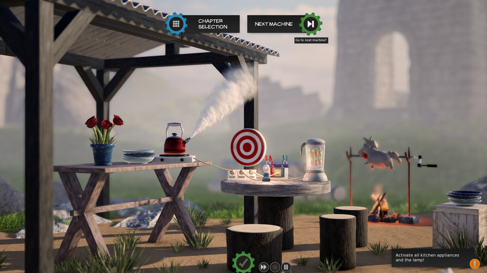
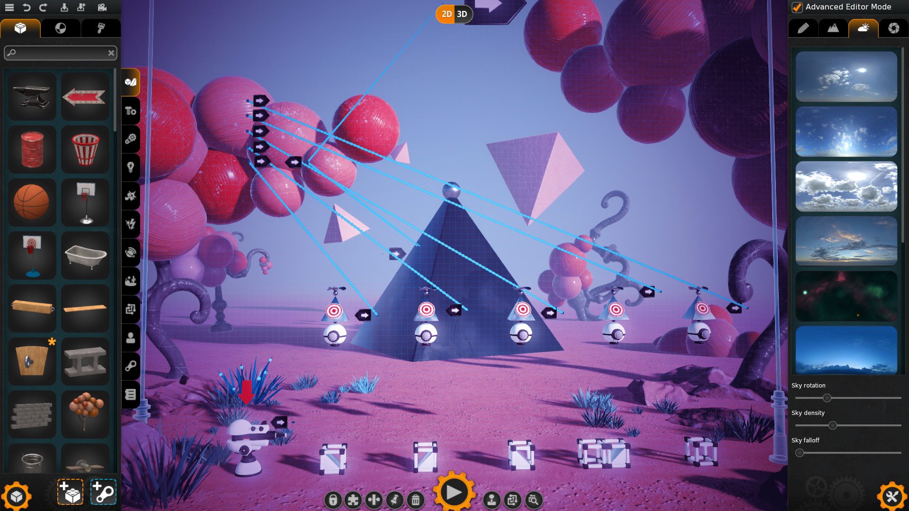

# Team and project
## Team code/name
> 17

## Team members list 
1. > Коротов Юрій -  **team leader**
1. > Полякова Любов
1. > Гусаренко Юлія
1. > Прокопеня Поліна
1. > Плахотна Дар'я

## Unity version
> Версія Unity (2020.3.21f1, наприклад)

 

# Lab
## About team task management (screenshot/description)

*To Do:* список запланованих features.

*In Progress:* список features, які розробляються.

*Complete:* список features, які є розробленими, але ще не тестованими.

*Test:* список features, які знаходяться в тестуванні.

*Done:* список features, які є завершеними.

## Chosen games analysis
### Angry birds

*Учасник команди:* Полякова Л. В.

*Жанр:*  казуальна відеогра-головоломка

*Тематика:* гравець керує зграєю різнокольорових птахів, які намагаються отримати свої яйця, вкрадені групою голодних зелених свиней. На кожному етапі ігрового процесу ворожі свині перебувають в укритті за конструкціями з різних матеріалів, таких як дерево, скло та камінь, які нагадують дитячі іграшкові будівельні блоки.

*Особливості графіки:* 2D, поліхромна.

*Ціль гри:* усунути всіх свиней на рівні. Використовуючи рогатку, гравці запускають обмежений набір птахів з метою або безпосередньо вдарити ворожих свиней, або пошкодити їх навколишні структури, змушуючи блоки руйнуватися та вбивати свиней.

*Cистема локацій:* локації мало чим змінюються

*Система персонажів:* У грі використовується кілька різних видів птахів, які відрізняються за кольором і формою. На ранніх рівнях доступний лише базовий червоний кардинал на ім'я Ред. У міру просування гравця в грі стають доступними додаткові види птахів. Деякі птахи ефективні проти певних матеріалів, а деякі мають спеціальні здібності, які гравець може активувати, коли птах знаходиться в повітрі.

*Система ворогів:* Свині різняться, витривалість залежить від їх розміру. Маленькі свині слабші, і їх легко перемогти прямими ударами або уламками пошкоджених структур, тоді як більші свині здатні витримати більше пошкоджень. Крім того, деякі свині носять капелюхи або броню, що робить їх ще більш стійкими до пошкоджень.

*Особливості переміщення:* кожний птах має різний розмір та вагу, що впливає на траєкторію їх руху і швидкість

*Особливості нанесення шкоди ворогу:* кожний птах має різні здібності щодо нанесення шкоди. Один взривається при дотику до землі чи будь-якого матеріалу, другий продукує яйця, що теж взриваються. Зруйновані конструкціі теж наносять шкоду ворогу.

*Особливості активних та пасивних предметів:* На різних етапах гри додаткові об’єкти, як-от TNT ящики та каміння, вбудовуються в конструкції. 

*Система очок:* бали нараховуються за кожну переможену свиню, а також за пошкодження або руйнування конструкцій.Після завершення кожного рівня гравці можуть отримати до трьох зірок залежно від отриманого балу. 

### Crazy Machines 3

*Учасник команди:* Прокопеня Поліна.

*Жанр:* Головоломка, розрахована на одного гравця.

*Тематика:* Створення механізмів для виконання різних завдань.

*Особливості графіки:* 3D, поліхромна.

*Система рівнів та локацій*: Гра поділена на 5 основних частин із усього 117 машинами, які потрібно побудувати, і додаткової частини з міні-іграми. З кожним рівнем завдання стають складнішими. Також доступний режим пісочниці, де гравець може експериментувати з механізмами та будувати машини за власним бажанням.

*Керування:* Миша.

*Сюжет:* Сюжета як такого в грі немає, але головоломки об'єднані за спільною тематикою, наприклад, космічною. На кожному рівні гравець допомагає героям поза лаштунками з якоюсь проблемою: дістати їжу, транспортувати сміття, пакунки тощо. Це пояснюється кількома реченнями на початку завдання. Цільної історії в грі нема, але гравцю таким чином дають маленькі пояснення для чого він будує механізм.

*Плюси:* 
<ol>
<li>Захоплюючий геймплей з цікавими задачами.</li>
<li>Можливість покреативити у пісочниці і створити власну головоломку.</li>
<li>Функція прискорення та сповільнення механізмів.</li>
</ol>

*Мінуси:*
<ol>
<li>Деякі рівні не дають гравцю чіткого розуміння, що потрібно зробити.</li>
<li>Міні-ігри не такі захоплюючі як основна гра.</li>
</ol>

### FEZ

*Учасник команди:* Гусаренко Ю.І.

*Жанр:* головоломка/платформер

*Особливості графіки:* 2D, піксельна

*Сюжет:* гра відправляє гравця у двовимірний світ, мешканця якого звуть Гомес. Одного разу він знаходить тривимірний предмет "Гіперкуб", який дає йому можливість відчувати третій вимір. Але фрагменти "Гіперкуба" опиняються розкиданми по всьому світу, між тим рідному світу головного героя загрожує катастрофа. Аби запобігти катастрофі, Гомесу необхідно зібрати усі фрагменти "Гіперкуба".

*Мета гри:* гравець має зібрати усі 64 фрагменти "Гіперкуба", розв'язуючи головоломки, рішення яких можна знайти повертаючи світ на 90 градусів у різних напрямках.

*Ігровий світ:* ігровий світ поділений на окремі рівні. Невеликі рівні поєднані з більш крупними рівнями-хабами, які в свою чергу поєднані з основним рівнем-хабом. З кожним рівнем локація  змінюється, дизайн і атмосфера яких варіюється від яскравих та позитивних до більш стриманих та моторошних. Серед локацій гри можна знайти ліси, фабрики, прибережний маяк, місто, бібліотеку тощо.

*Система персонажів:* у грі присутній головний герой на ім'я Гомес та його компаньйон на ім'я Точка, який виступає в образі різнокольорового тетракубу.

*Система ворогів:* у грі відсутні супротивники, вороги або боси. Окрім цього в грі відсутнє покарання за помилки, впавши з платформи, гравець одразу воскресає.

*Механіка гри:* в основі гри лежить стандартна механіка 2D-платформерів. Гравець, керуючи Гомесом, може ходити по платформам, стрибати, карабкатись по ліанам та драбинам, маніпулювати певними предметами, за допомогою чого необхідно зібрати розкидані по рівнях фрагменти кубиків. Але для вирішення деяких загадок на певних локація гравцеві можуть знадобитися знання криптографії та лінгвістики, а також навичка просторового мислення.

*Особливості активних та пасивних предметів:* на різних рівнях з'являються різноманітні об'єкти з власними механіками: бомби, які дозволяють підривати фрагменти стін, рухомі вертикальні платформи, чіпляючись за які головний герой має можливість підійматись по стіні, платформи, що обертаються, а також платформи, які дозволяють головному герою стрибати вище.

### Gordian Quest

*Учасник команди:* Коротов Ю.С.

*Жанр:* карточний roguelite

*Тематика:* створення властної команди героїв та проходження битв за них, близько до классичної пригоди Dungeon and Dragons

*Особливості графіки:* 2.5D, трохи у стилі аніме

*Сюжет:* Гра розподілена на 4 акти: 1ий про порятунок міста від некроманта, 2ий про пошук входу у стародавні руїни та пошук головного злодія, 3ий про подорож скрізь сніжні гори до небесного міста, 4ий про небесне місто стародавньої раси та зупинення головного злодія

*Мета гри:* успшішно пройти усі квести та битви, не втративши всіх героїв у поєдинку

*Система персонажів:* гравцю дозволяется обрати до трьох героїв з десяти. Широка кастомізація обраних героїв: спорядження, характеристики(сила, спритність, інтелект), таланти, 3 колоди для обирання карти при підвищені рівня. Безліч варіацій дозволяют кожен раз отримувати унікальний опит

*Система карти світу:* карти світу представлена у вигляді зв'язаного графу. Кожна вершина графу может бути: івентом, сутичкою, пустим, алтарем, місцем відпочинку, безкоштовним лікуванням

*Система битви:* битви розділені на раунди. Порядок ходу у раунді виявляє ініциатива кожного ворога та героя на полі. Поле битви розподілено на дві частини: союзну та ворожу. Все поле має вигляд прямокутної матриці з рядів та ліній. Певні клітинки можуть мати негативні ефекти та позитивні ефекти. Гравець завжди бачить дії ворога, так куди він націлений. Гравець кожний раунд витягує карти для розіграшу із особистої колоди та відновлює енергію для розіграшу карт. У свій хід герой може пересувати героя по своїй частині битви за енергію, або розігрувати відповідні карти

*Система карт гравця:* кожен персонаж має три колоди з якої може обирати карти при підвищені рівня. Кожна колода об'єднана певною тематикою, але гравець не зобов'язаний кожен раз обирати карти лише з одної колоди. Кожна карта має один з 4ьох колорів: червоний, зелений, синій, філетовий. В залежності від кольору у характеристиках картки буде використана одна з характеристик героя відповідно: сила, спритність, інтелект, найкраща з трьох. Кожна карта має обмеження на кого вона може бути використана. Більшість карт може бути покращена підвищенням рівня карти, що зробить її характеристики краще.

### The Dark Pictures Anthology: Little Hope

*Учасник команди:* Плахотна Д.О.

*Жанр:* інтерактивна драма/виживальні жахи

*Особливості графіки:* 3D.

*Сюжет:* гра оповідає історію чотирьох студентів коледжу та їхнього професора, чий автобус потрапив в аварію в Новій Англії поблизу міста-примари Літтл Хоуп, відомого своїми судами над відьмами, що проходили там у 1692 році. Намагаючись знайти допомогу та зниклого водія їхнього автобусу, герої періодично переміщуються у часі, у XVII століття, де зустрічають схожих на них поселенців із пуританської громади. Група намагається знайти пояснення свого зв'язку з гостями з минулого, дізнатися історію міста і першопричину зла, що вразило його.

*Ціль гри:* знайти спосіб вибратися з пастки та врятувати всіх персонажів до фінальних титрів.

*Ігровий процес:*  Little Hope пропонує гравцям чотири режими гри : одиночний, який дозволяє грати в гру з основної (Theatrical Cut) або альтернативної (Curator's Cut) точки зору, і багатокористувацький, який дозволяє двом гравцям онлайн (Shared Story) або двом п'ятьом офлайн (Movie Night) грати в гру.
Геймплей зосереджений на дослідженні, "скіл-чеках" і знаходженні предметів колекціонування. Останні містять зображення, які показують можливі майбутні події та таємниці, які розкривають знання та допомагають дізнатися секрети містечка Little Hope 1692 та 1972 років. Внутрішньоігрова система відстежує всі виявлені предмети колекціонування, роблячи їх завжди доступними для гравця, незалежно від їх поточного проходження. Збір усіх або деяких предметів, а також завершення гри нагороджує гравця бонусним вмістом, який надає додаткову інформацію про знання та розвиток гри.

*Механіка гри:* протягом усієї гри гравець постійно стикається з моральними дилемами, починаючи від звичайних діалогів і закінчуючи життєвими та смертельними ситуаціями (втікати чи битися, кого рятувати тощо). Для цих випадків у гравця є *моральний компас*, який пропонує йому два-три варіанти відповіді — діяти раціонально («Голова»), діяти емоційно («Серце») або говорити/нічого не робити. Однак час на вибір обмежений (приблизно 5-10 секунд залежно від ситуації). 
Little Hope використовує систему « пеленгів », яка фіксує будь-які дії, зроблені гравцем, які можуть мати серйозні наслідки пізніше та вплинути на результат гри. Крім того, деякі неправильні вибори призводять до того, що персонаж отримує заблоковану рису , що ускладнює гру. Ця механіка є ексклюзивною для Little Hope.

*Система карти світу:* відкритий світ з можливістю дізнатися додаткову деталь сюжету через передбачення можливого майбутнього.

*Система битви:* натискання конкретних клавіш за обмежений час (скіл-чеки).

*Система ворогів:* вороги присутні, нападають на гравця в залежності від сюжету; не мають таких характеристик як урон, здоров'я, стаміна, мана тощо. Взаємодія відбувається тільки через QTE.

*Кінцівка:* результат гри залежить від вибору гравця. Існує 7 кінцівок з варіаціями в залежності від персонажів, що вижили.
